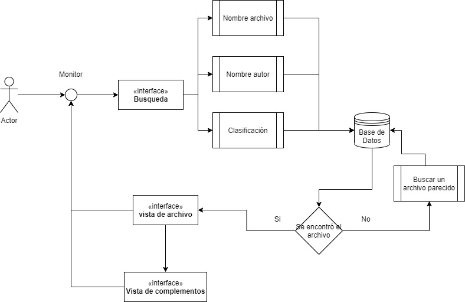

# Tipo de Sistema de Información

## :trophy: C0.2 Reto en clase
Investigación sobre el tipo de sistema que involucra el caso de estudio a desarrollar

___
# Intruscciones
- Realizar una investigación sobre el tipo de sistema que se habrá de desarrollar,  respondiendo a las preguntas que se plantean en la sesión de desarrollo. 
- Puede apoyarse de la herramienta Draw.io para elaborar los diagramas o  ilustraciones que se solicitan o considere necesario.
- Toda actividad o reto se deberá realizar utilizando el estilo **MarkDown con  extension .md** y el entorno de desarrollo VSCode, debiendo ser elaborado  como un documento **single page**, es decir si el documento cuanta con  imágenes, enlaces o cualquier documento externo debe ser accedido desde  etiquetas y enlaces.
- Es requisito que el archivo .md contenga una etiqueta del enlace al repositorio  de su documento en Github, por ejemplo **Enlace a mi GitHub** 
- Al concluir el reto el reto se deberá subir a github el archivo .md creado. 
- Desde el archivo **.md** se debe exportar un archivo **.pdf** con la nomenclatura  **C0.4_NombredelaActividad_NombreAlumno.pdf**, el cual deberá subirse a  classroom dentro de su apartado correspondiente, para que sirva como  evidencia de su entrega; siendo esta plataforma oficial aquí se recibirá la  calificación de su actividad por individual.
- Considerando que el archivo .pdf, fue obtenido desde archivo .md, ambos deben  ser idénticos y mostrar el mismo contenido.  
- Su repositorio ademas de que debe contar con un archivo **readme.md** dentro de su directorio raíz, con la información como datos del estudiante, equipo de  trabajo, materia, carrera, datos del asesor, e incluso logotipo o imágenes, debe  tener un apartado de contenidos o indice, los cuales realmente son ligas o  **enlaces a sus documentos .md**, evite utilizar texto para indicar enlaces  internos o externo.  
- Se propone una estructura tal como esta indicada abajo, sin embargo puede  utilizarse cualquier otra que le apoye para organizar su repositorio.

```
| readme.md 
| | blog 
| | | Cx.1_NombredelaActividad.md 
| | | Ax.1_NombredelaActividad.md 
| | diagrams 
| | docs 
| | html 
| | img 
| | pdf 
```
___
## :pencil2: Desarrollo
1. Apoyado de la información mostrada por el asesor, realice una investigación,  donde se pueda dar respuesta a los siguientes puntos:  

- Identifique a que tipo de sistema esta referido el caso de estudio y porque cae  en esta categoría. 

El caso de estudio de búsqueda del conocimiento cae en la categoría **KMS**(Software de Gestion del Conocimiento). La razón por la que cae en esta categoría es que el caso de estudio se enfoca en proporcionar conocimiento a través de libros los cuales pueden tener anexados imágenes, videos o presentaciones que pueden ayudar a complementar alguna información en específico de un tema buscado. Es decir que cumple con la descripcion de **KMS** de que es un software que se especializa en la que se recopila, almacena y se accede a la informacion.

- Describa las características que debe tener el caso de estudio para cumplir con  el tipo de sistema.  
Las características que debe cumplir este sistema para ser considerado en parte de la categoría de **KMS**:

- **Agregar contedino de fuentes internas y externas:** esto quiere decir que se debe almacenar en la base de datos libros o archivos creados internamnetes en la empresa o institucion, y en libros o documentos relazionados publicados ajenamente.
- **Clasificación de contenido mediante taxonomías:** quiere decir que todos los conocimientos se clasificaran mediante un árbol que divira todos los conocimientos.
- **Buscar:** Permite buscar un conoximiento determinado mediante su categoria o su nombre.
- **Ubicación de la experiencia:** en donde se encontrara alojado el software, ya sea en una paguina web o un software que se instala en una computadora.
- **Vistas / paneles:** se refiere a la interfaz y como se visualizara el conocimiento para el usuario.

-Una vez que se cuenta con los conceptos de los puntos anteriores, elabore una  ilustración que explique el flujo de interacción del sistema y sus componentes  que lo habrán de integrar (vistas gráficas, controladores, Base de datos,..) para  el caso de estudio.  



- Explique en clase su investigación
___
## :bomb: Rubrica
Creterios| Descripción| Puntaje
---------|----------|---------|
Intruciones| Se cumple con cada uno de los puntos indicados del apartado de intrucciones?| 20 |
Desarrollo| Se respondio a cada uno de los puntos solicitados dentro del desarrollo de la actividad?| 80|

:house: [Link de mi GitHub](https://github.com/Dany305/Analisis-Avanzado-de-Software)
