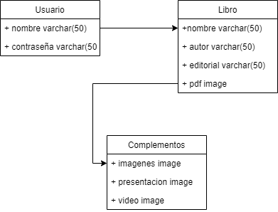
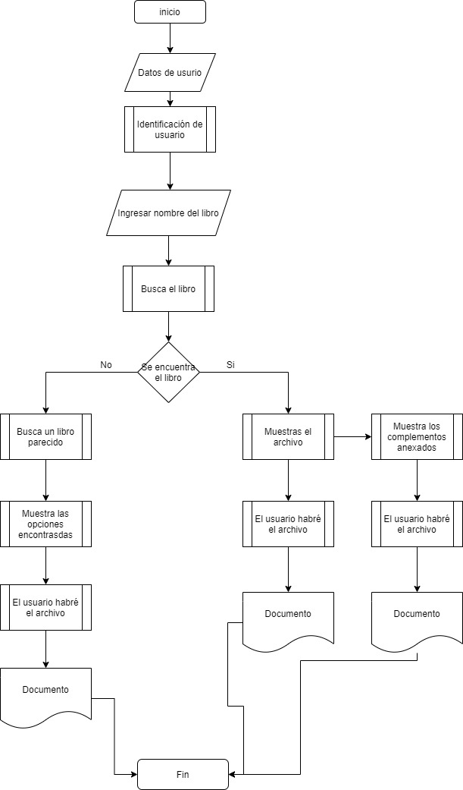

# Tipo de Sistema de Información

## :trophy: C0.2 Reto en clase
Investigación sobre el tipo de sistema que involucra el caso de estudio a desarrollar

___
# Intruscciones
- Realizar una investigación sobre el tipo de sistema que se habrá de desarrollar,  respondiendo a las preguntas que se plantean en la sesión de desarrollo. 
- Puede apoyarse de la herramienta Draw.io para elaborar los diagramas o  ilustraciones que se solicitan o considere necesario.
- Toda actividad o reto se deberá realizar utilizando el estilo **MarkDown con  extension .md** y el entorno de desarrollo VSCode, debiendo ser elaborado  como un documento **single page**, es decir si el documento cuanta con  imágenes, enlaces o cualquier documento externo debe ser accedido desde  etiquetas y enlaces.
- Es requisito que el archivo .md contenga una etiqueta del enlace al repositorio  de su documento en Github, por ejemplo **Enlace a mi GitHub** 
- Al concluir el reto el reto se deberá subir a github el archivo .md creado. 
- Desde el archivo **.md** se debe exportar un archivo **.pdf** con la nomenclatura  **C0.4_NombredelaActividad_NombreAlumno.pdf**, el cual deberá subirse a  classroom dentro de su apartado correspondiente, para que sirva como  evidencia de su entrega; siendo esta plataforma oficial aquí se recibirá la  calificación de su actividad por individual.
- Considerando que el archivo .pdf, fue obtenido desde archivo .md, ambos deben  ser idénticos y mostrar el mismo contenido.  
- Su repositorio ademas de que debe contar con un archivo **readme.md** dentro de su directorio raíz, con la información como datos del estudiante, equipo de  trabajo, materia, carrera, datos del asesor, e incluso logotipo o imágenes, debe  tener un apartado de contenidos o indice, los cuales realmente son ligas o  **enlaces a sus documentos .md**, evite utilizar texto para indicar enlaces  internos o externo.  
- Se propone una estructura tal como esta indicada abajo, sin embargo puede  utilizarse cualquier otra que le apoye para organizar su repositorio.

```
| readme.md 
| | blog 
| | | Cx.1_NombredelaActividad.md 
| | | Ax.1_NombredelaActividad.md 
| | diagrams 
| | docs 
| | html 
| | img 
| | pdf 
```
___
## :pencil2: Desarrollo

El caso de estudio de búsqueda del conocimiento cae en la categoría de software de aplicación y en la categoría de software educativo. La razón por la que cae en esta categoría es que el caso de estudio se enfoca en proporcionar conocimiento a través de libros los cuales pueden tener anexados imágenes, videos o presentaciones que pueden ayudar a complementar alguna información en específico de un tema buscado.

Las características que debe cumplir este sistema para ser considerado en parte de la categoría de software de educación son las siguientes:

- **Tener un objetivo didáctico:** es decir que debe cumplir con un plan para la obtención de conocimientos, que en este caso sería a través de la lectura de diversos libros junto a información adicional como lo serian imágenes, videos y presentaciones.
- **Necesitar de un dispositivo digital para acceder:** se deberá hacer uso de un dispositivo electrónico como lo seria la computadora, una tableta o un smartphone, con el propósito de poder tener disponible la aplicación en todo momento.
- **Ser interactivo:** el software debe requerir la constante interacción de usuario para su funcionamiento correcto.
- **Ser fácil de usar:** su interfaz debe ser instintiva para los usuarios, es decir que con solo ver la sean capaces de comprender como hacer uso del programa sin frustrarse al no poder manejar la interfaz.   




___
## :bomb: Rubrica
Creterios| Descripción| Puntaje
---------|----------|---------|
Intruciones| Se cumple con cada uno de los puntos indicados del apartado de intrucciones?| 20 |
Desarrollo| Se respondio a cada uno de los puntos solicitados dentro del desarrollo de la actividad?| 80|

:house: [Link de mi GitHub](https://github.com/Dany305/Analisis-Avanzado-de-Software)
